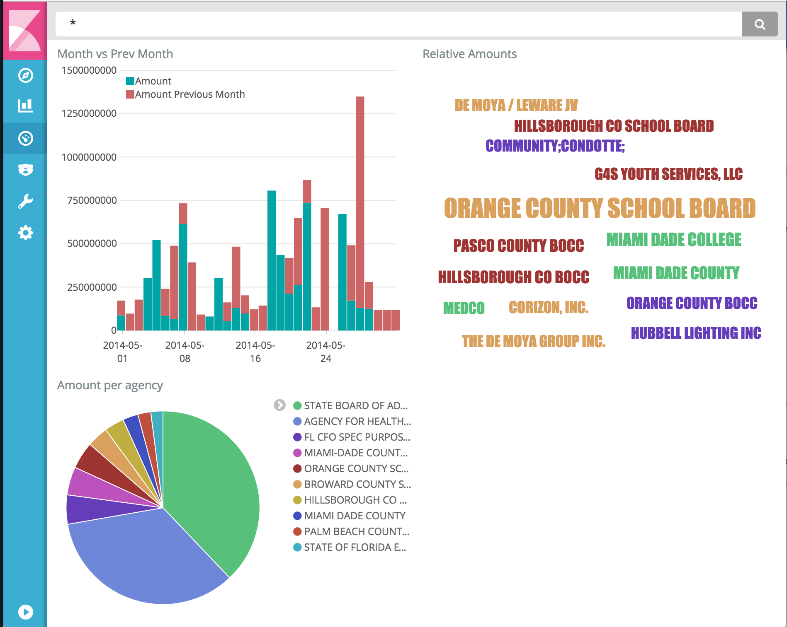

# Datamnom

tl;dr: Generic data ingestion for [Elasticsearch](https://www.elastic.co/products/elasticsearch) to be visualized by [Kibana](https://www.elastic.co/products/kibana).

Originally created for a local [Hack for Change event](https://medium.com/zumba-tech/zumbatech-takes-on-hackforchange-f8e8ebdc14d7#.2vfjxtk03), this project aims to get quick visualizations via Kibana that look like this:

> Dashboard above produced in Kibana from an import of [Florida Vendor data](https://github.com/cjsaylor/datamnom/wiki/Florida-Vendor-Data) from 2014 that was open sourced by FL state government.

## Why this method, why not make an API

Elasticsearch serves as both a generic search tool, but it also functions as an API through
Elasticsearch's rest interface while simultaneously supplying an aggregation and visualization framework
through Kibana and Timelion.

## Requirements

* Docker `1.8+`
* NodeJS `6.0+`

## Install

* `docker-compose up -d`
* `npm install`

## Use

* Access locally: http://localhost:5601/.
* Add `json` configuration to `inbound/`, see [`FY2013.json`](https://github.com/cjsaylor/datamnom/wiki/Florida-Vendor-Data) for an example.
* Copy  into `inbound/` folder and run `node bin/datamnom.js` to import into Elasticsearch.
* See [the wiki](../../wiki) for specific use-cases.
